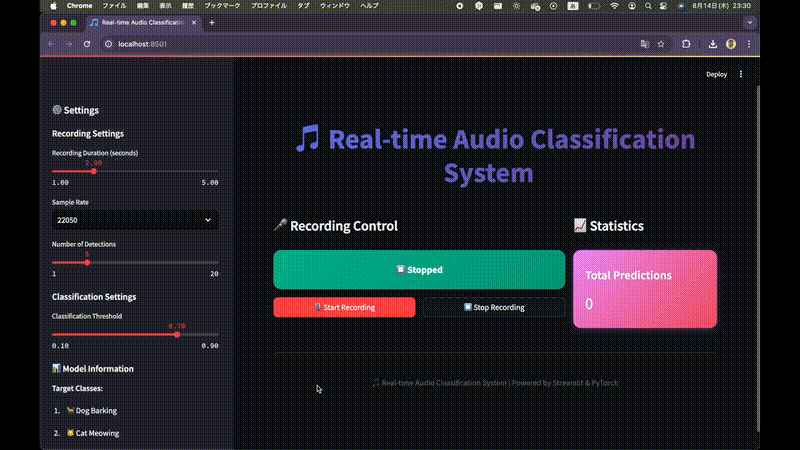
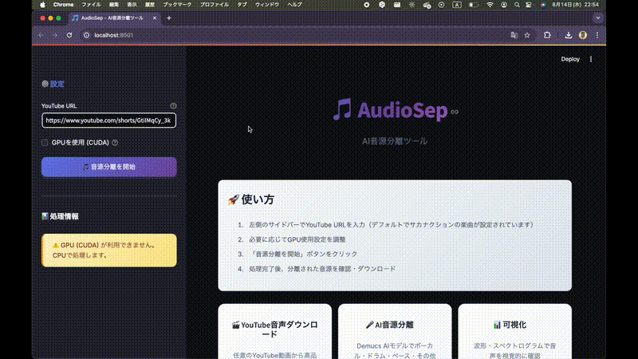

# 🎵 AudioDNN - AI音声処理総合プラットフォーム

<div align="center">


**深層学習による音声処理の総合的な研究・開発プラットフォーム**

[🚀 クイックスタート](#-クイックスタート) • [📖 プロジェクト一覧](#-プロジェクト一覧) • [🎬 デモ](#-デモ) • [🛠️ セットアップ](#-セットアップ) • [🤝 貢献](#-貢献)

</div>

---

## ✨ プロジェクト概要

AudioDNNは、**深層学習**と**音声処理技術**を組み合わせた総合的な研究・開発プラットフォームです。キーワード検出、音源分離、リアルタイム音声分類など、様々な音声AIタスクを統合的に提供します。

### 🎯 主な特徴

- 🧠 **最先端AIモデル** - BC-ResNet、U-Net、CNNなど最新アーキテクチャ
- 🎵 **多様な音声処理** - キーワード検出、音源分離、音声分類
- 🌐 **美しいWebアプリ** - Streamlitによる直感的なインターフェース
- ⚡ **リアルタイム処理** - 低遅延での音声分析
- 📊 **豊富な可視化** - 波形、スペクトログラム、確率分布
- 🔧 **研究・開発対応** - 学習から推論まで完全サポート

---

## 🎬 デモ

AudioDNNの各プロジェクトの動作を確認できるデモをご覧ください：

<div align="center">

### 🎙️ リアルタイム音声分類システム



*リアルタイム音声分類のプレビュー - より詳しく見るには下のボタンをクリック*

[](https://github.com/user-attachments/assets/8225f857-8da6-4efd-952c-875275e76db8)

### 🎵 YouTube音源分離システム



*AudioSepのプレビュー - より詳しく見るには下のボタンをクリック*

[](https://github.com/user-attachments/assets/04fdc669-24c3-49f3-bc68-faada70230f9)

</div>

---

## 📖 プロジェクト一覧

<div align="center">

| プロジェクト | 技術 | 機能 | 精度 | ステータス |
|-------------|------|------|------|-----------|
| **[🎙️ keyword_spotting_custom](#-keyword_spotting_custom)** | CNN | リアルタイム音声分類 | 90%+ | ✅ **完成** |
| **[🎵 AudioSep_youtube](#-audiosep_youtube)** | Demucs/U-Net | YouTube音源分離 | SDR 6-7dB | ✅ **完成** |
| **[🔍 keyword_spotting](#-keyword_spotting)** | BC-ResNet | キーワード検出 | 98.7% | ✅ **完成** |
| **[🎼 audio_separation](#-audio_separation)** | U-Net | 音楽音源分離 | SDR 6-7dB | ✅ **完成** |

</div>

---

## 🎙️ keyword_spotting_custom

**リアルタイム音声分類システム - 環境音をAIで自動認識**

### ✨ 特徴
- 🎙️ **リアルタイム録音・分析** - マイクからの音声を即座に分類
- 🧠 **高精度AIモデル** - CNNベースの深層学習で90%以上の精度
- 🎨 **美しいUI/UX** - モダンなStreamlitインターフェース
- 📊 **豊富な可視化** - 波形、スペクトログラム、確率分布を表示

### 🎯 対象音声クラス
- 🐕 **犬の鳴き声** - Dog Barking
- 🐱 **猫の鳴き声** - Cat Meowing  
- 🐦 **鳥のさえずり** - Bird Chirping
- 👆 **指パッチン** - Finger Snap
- 👤 **人の声** - Human Voice

### 🚀 クイックスタート
```bash
cd keyword_spotting_custom
pip install -r requirements.txt
streamlit run app.py
```

**[📖 詳細はこちら](keyword_spotting_custom/README.md)**

---

## 🎵 AudioSep_youtube

**YouTube音声からボーカル・楽器を自動分離するAIツール**

### ✨ 特徴
- 🎬 **YouTube音声ダウンロード** - 任意のYouTube動画から音声を自動取得
- 🎤 **高品質音源分離** - ボーカル、ドラム、ベース、その他楽器を分離
- 🤖 **2つの実装方式** - 事前学習済みモデル or 独自学習モデル
- ⚡ **GPU対応** - CUDAを使用した高速処理

### 🎯 分離音源
- 🎤 **ボーカル** - Vocals
- 🥁 **ドラム** - Drums  
- 🎸 **ベース** - Bass
- 🎹 **その他楽器** - Other

### 🚀 クイックスタート
```bash
cd AudioSep_youtube
pip install -r requirements.txt
streamlit run app.py
```

**[📖 詳細はこちら](AudioSep_youtube/README.md)**

---

## 🔍 keyword_spotting

**BC-ResNetによる高精度キーワード検出システム**

### ✨ 特徴
- 🧠 **BC-ResNet** - Broadcasted Residual Learning for Efficient Keyword Spotting
- 🎯 **高精度** - Speech Commands v2で98.7%の精度
- ⚡ **効率的** - 軽量モデルで高速処理
- 🔧 **スケーラブル** - 複数のモデルサイズ（τ = 1, 1.5, 2, 3, 6, 8）

### 🎯 検出キーワード
Google Speech Commands v2の12クラス：
- `down`, `go`, `left`, `no`, `off`, `on`, `right`, `stop`, `up`, `yes`
- `_silence_`, `_unknown_`

### 🚀 クイックスタート
```bash
cd keyword_spotting
pip install -r requirements.txt
python demo.py
```

**[📖 詳細はこちら](keyword_spotting/README.md)**

---

## 🎼 audio_separation

**U-Netによる音楽音源分離システム**

### ✨ 特徴
- 🧠 **U-Net** - エンコーダー・デコーダー構造による高品質分離
- 🎵 **4音源分離** - ボーカル、ドラム、ベース、その他楽器
- ⚡ **リアルタイム処理** - 12-46倍速の高速処理
- 📊 **MUSDB18対応** - 標準データセットでの評価

### 🎯 技術仕様
- **パラメータ数**: 10.9M
- **モデルサイズ**: 41.66 MB
- **入力**: ステレオ音声（44.1kHz）
- **出力**: 4音源分離音声ファイル

### 🚀 クイックスタート
```bash
cd audio_separation
pip install -r requirements.txt
python test_basic.py
```

**[📖 詳細はこちら](audio_separation/README.md)**

---

## 🚀 クイックスタート

### 1️⃣ 環境セットアップ

```bash
# リポジトリをクローン
git clone https://github.com/yourusername/AudioDNN.git
cd AudioDNN

# 仮想環境を作成（推奨）
python -m venv venv
source venv/bin/activate  # Linux/Mac
# venv\Scripts\activate  # Windows
```

### 2️⃣ プロジェクト選択

各プロジェクトのディレクトリに移動してセットアップ：

```bash
# リアルタイム音声分類
cd keyword_spotting_custom
pip install -r requirements.txt
streamlit run app.py

# YouTube音源分離
cd ../AudioSep_youtube
pip install -r requirements.txt
streamlit run app.py

# キーワード検出
cd ../keyword_spotting
pip install -r requirements.txt
python demo.py

# 音楽音源分離
cd ../audio_separation
pip install -r requirements.txt
python test_basic.py
```

### 3️⃣ ブラウザでアクセス

Webアプリケーション：
- **リアルタイム音声分類**: `http://localhost:8501`
- **YouTube音源分離**: `http://localhost:8501`

---

## 🛠️ セットアップ

### 📋 必要条件

| 要件 | 詳細 |
|------|------|
| 🐍 **Python** | 3.8以上 |
| 🧠 **PyTorch** | 2.0以上 |
| 🎤 **マイク** | 音声入力用（リアルタイム処理） |
| 🖥️ **GPU** | 推奨（CUDA対応） |
| 📦 **FFmpeg** | 音声変換用 |

### 🔧 インストール

#### 基本セットアップ
```bash
# 依存関係のインストール
pip install torch torchvision torchaudio
pip install streamlit librosa numpy matplotlib
pip install yt-dlp ffmpeg-python
```

#### FFmpegのインストール
```bash
# macOS
brew install ffmpeg

# Ubuntu
sudo apt-get install ffmpeg

# Windows
# https://ffmpeg.org/download.html からダウンロード
```

---

## 📊 性能比較

<div align="center">

| プロジェクト | モデル | 精度/性能 | 処理速度 | 用途 |
|-------------|--------|-----------|----------|------|
| **keyword_spotting_custom** | CNN | 90%+ | リアルタイム | 環境音分類 |
| **AudioSep_youtube** | Demucs/U-Net | SDR 6-7dB | 高速 | 音源分離 |
| **keyword_spotting** | BC-ResNet | 98.7% | 高速 | キーワード検出 |
| **audio_separation** | U-Net | SDR 6-7dB | 12-46倍速 | 音楽分離 |

</div>

---

## 🎯 使用例

### 🎙️ リアルタイム音声分類
```python
# keyword_spotting_custom
import streamlit as st
from sound_classifier_5class import SoundClassifier

# 分類器の初期化
classifier = SoundClassifier()

# リアルタイム録音と分類
# Webアプリで自動実行
```

### 🎵 YouTube音源分離
```python
# AudioSep_youtube
from pretrained_demucs_main import separate_youtube_audio

# YouTube音声を分離
separate_youtube_audio("https://www.youtube.com/watch?v=example")
```

### 🔍 キーワード検出
```python
# keyword_spotting
from bcresnet import create_bcresnet
from demo import predict_audio

# モデル作成
model = create_bcresnet(tau=1.0)

# 音声予測
label, confidence = predict_audio(model, "audio.wav")
```

### 🎼 音楽音源分離
```python
# audio_separation
from src.models.separator import SourceSeparator

# 分離器作成
separator = SourceSeparator(model=model)

# 音源分離
output_paths = separator.separate_file("music.wav", "output/")
```

---

## 🏗️ アーキテクチャ

### 🧠 使用技術

<div align="center">

| 技術 | 用途 | 特徴 |
|------|------|------|
| **CNN** | 音声分類 | 畳み込み層による特徴抽出 |
| **BC-ResNet** | キーワード検出 | ブロードキャスト残差学習 |
| **U-Net** | 音源分離 | エンコーダー・デコーダー構造 |
| **Demucs** | 音源分離 | Meta/Facebook Research |
| **Streamlit** | Webアプリ | 美しいUI/UX |

</div>

### 📊 データフロー

```
音声入力 → 前処理 → AIモデル → 後処理 → 結果出力
    ↓         ↓         ↓         ↓         ↓
  マイク    STFT/    推論     可視化     Web表示
  ファイル   メル     処理     処理      保存
```

---

## 🔧 開発・カスタマイズ

### 🎨 新しいモデルの追加

```python
# カスタムモデルの実装例
class CustomAudioModel(nn.Module):
    def __init__(self, num_classes):
        super().__init__()
        # モデルアーキテクチャの定義
        
    def forward(self, x):
        # フォワードパスの実装
        return output
```

### 📊 新しいデータセットの対応

```python
# カスタムデータセットの実装例
class CustomAudioDataset(Dataset):
    def __init__(self, data_dir):
        # データセットの初期化
        
    def __len__(self):
        return len(self.data)
        
    def __getitem__(self, idx):
        # データの取得と前処理
        return audio, label
```

### 🌐 新しいWebアプリの作成

```python
# Streamlitアプリの基本構造
import streamlit as st

def main():
    st.title("カスタム音声処理アプリ")
    
    # 音声入力
    audio_file = st.file_uploader("音声ファイルをアップロード")
    
    if audio_file:
        # 処理実行
        result = process_audio(audio_file)
        st.write(result)

if __name__ == "__main__":
    main()
```

---

## 🐛 トラブルシューティング

### ❗ よくある問題

<div align="center">

| 問題 | 解決方法 |
|------|----------|
| **🎤 マイクが認識されない** | ブラウザのマイク権限を確認 |
| **📁 モデルが読み込めない** | モデルファイルのパスを確認 |
| **⏺️ 録音が開始されない** | マイクの接続とブラウザコンソールを確認 |
| **💾 メモリ不足** | バッチサイズを小さくする |
| **🔧 CUDAエラー** | GPU版PyTorchのインストールを確認 |

</div>

### 🚀 パフォーマンス最適化

| 設定 | 推奨値 | 理由 |
|------|--------|------|
| **バッチサイズ** | 8-16 | メモリと速度のバランス |
| **サンプリングレート** | 22.05kHz | 品質と処理速度のバランス |
| **チャンクサイズ** | 5-10秒 | リアルタイム性の確保 |

---

## 📝 注意事項

<div align="center">

⚠️ **重要事項**

</div>

- 🎵 音声ファイルはWAV形式を推奨
- 🔧 サンプリングレートは統一される場合があります
- ⏱️ リアルタイム処理は静かな環境で使用を推奨
- 📊 分類精度は環境音や音質に影響される場合があります
- ⏰ 長時間の連続使用は避けてください
- ⚖️ YouTubeの利用規約と著作権法を遵守してください

---

## 🤝 貢献

<div align="center">

**プロジェクトへの貢献を歓迎します！** 🎉

</div>

### 📋 貢献の手順

1. 🍴 このリポジトリをフォーク
2. 🌿 機能ブランチを作成 (`git checkout -b feature/AmazingFeature`)
3. 💾 変更をコミット (`git commit -m 'Add some AmazingFeature'`)
4. 📤 ブランチにプッシュ (`git push origin feature/AmazingFeature`)
5. 🔄 プルリクエストを作成

### 🎯 貢献可能な分野

- 🐛 **バグ修正** - 既存の問題の解決
- ⚡ **性能改善** - 処理速度や精度の向上
- 🎨 **UI/UX改善** - ユーザーインターフェースの改善
- 📚 **ドキュメント** - 説明書やチュートリアルの追加
- 🧪 **テスト** - テストケースの追加
- 🌟 **新機能** - 新しい音声処理機能の追加

---

## 📄 ライセンス

<div align="center">

このプロジェクトは **[MITライセンス](LICENSE)** の下で公開されています。

</div>

---

## 🙏 謝辞

<div align="center">

| プロジェクト | 用途 | リンク |
|-------------|------|--------|
| **ESC-50 Dataset** | 環境音データセット | [GitHub](https://github.com/karolpiczak/ESC-50) |
| **MUSDB18** | 音楽源分離データセット | [Website](https://sigsep.github.io/datasets/musdb.html) |
| **Demucs** | Meta/Facebook Research | [GitHub](https://github.com/facebookresearch/demucs) |
| **Streamlit** | Webアプリフレームワーク | [Website](https://streamlit.io/) |
| **PyTorch** | 深層学習フレームワーク | [Website](https://pytorch.org/) |
| **librosa** | 音声処理ライブラリ | [Website](https://librosa.org/) |

</div>

---

<div align="center">

## 🎵 AudioDNN - AI音声処理総合プラットフォーム

**Powered by PyTorch & Streamlit**

[⬆️ トップに戻る](#-audiodnn---ai音声処理総合プラットフォーム)

</div> 