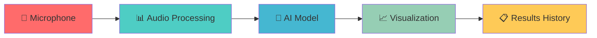

# 🎵 Real-time Audio Classification System

<div align="center">


**🎯 AI-Powered Real-time Audio Classification with Beautiful Web Interface**

[](https://github.com/user-attachments/assets/8225f857-8da6-4efd-952c-875275e76db8)
[](https://your-app-url.streamlit.app)

[](README_JP.md)

</div>

---

<div align="center">

### 🌟 **Revolutionary Audio AI** 🌟

**Transform your microphone into an intelligent sound detector!**  
*Detect dogs, cats, birds, finger snaps, and human voices in real-time with stunning visualizations.*

</div>

---

## 🚀 **Live Demo**

<div align="center">

### 📹 **Watch the Magic Happen**

[](https://github.com/user-attachments/assets/8225f857-8da6-4efd-952c-875275e76db8)

*Experience the future of audio classification in action!*

</div>

---

## ✨ **What Makes This Special?**

<div align="center">

| 🎯 **Real-time Processing** | 🎨 **Beautiful UI** | 📊 **Smart Analytics** |
|:---:|:---:|:---:|
| Instant audio classification | Modern gradient design | Detailed statistics |
| Live microphone input | Smooth animations | Historical tracking |
| 5-class detection | Responsive layout | Performance metrics |

</div>

### 🎮 **Key Features**

- 🔴 **Live Recording**: Real-time microphone input with instant analysis
- 🎵 **5 Audio Classes**: Dog, Cat, Bird, Finger Snap, Human Voice
- 📈 **Visual Analytics**: Waveforms, spectrograms, probability distributions
- 📋 **Smart History**: Chronological detection log with timestamps
- ⚙️ **Flexible Settings**: Customizable recording parameters
- 🎨 **Modern Interface**: Beautiful gradients and smooth animations

---

## 🛠️ **Quick Start**

<div align="center">

### 🚀 **Get Started in 3 Steps**

</div>

### 1️⃣ **Installation**

```bash
# Clone the repository
git clone https://github.com/yourusername/audio-classification-system.git
cd keyword_spotting_custom

# Install dependencies
pip install -r requirements.txt
```

### 2️⃣ **Launch the App**

```bash
# Start the Streamlit application
streamlit run app.py
```

### 3️⃣ **Start Classifying**

1. Open your browser to `http://localhost:8501`
2. Adjust settings in the sidebar
3. Click **🎙️ Start Recording**
4. Make some sounds and watch the magic!

---

## 🎯 **How It Works**

<div align="center">



</div>

### 🔬 **Technical Process**

1. **🎤 Audio Capture**: Real-time microphone recording
2. **🔧 Preprocessing**: Mel-spectrogram conversion
3. **🤖 AI Classification**: CNN-based deep learning model
4. **📊 Visualization**: Real-time graphs and charts
5. **📋 Storage**: Historical data management

---

## 🎨 **Beautiful Interface**

<div align="center">

### 🌈 **Modern Design Elements**

- **Gradient Backgrounds**: Purple-blue color schemes
- **Smooth Animations**: Pulse, slide-in, and fade effects
- **Responsive Layout**: Adapts to any screen size
- **Interactive Elements**: Hover effects and transitions

</div>

### 📱 **User Experience**

- **Intuitive Controls**: Clear start/stop buttons
- **Real-time Feedback**: Live status indicators
- **Smart Notifications**: Success and error messages
- **Progress Tracking**: Visual progress bars

---

## 📊 **Detection Classes**

<div align="center">

| 🐕 **Dog Barking** | 🐱 **Cat Meowing** | 🐦 **Bird Chirping** | 👆 **Finger Snap** | 👤 **Human Voice** |
|:---:|:---:|:---:|:---:|:---:|
| Canine sounds | Feline vocalizations | Avian melodies | Digital clicks | Human speech |
| High accuracy | Natural detection | Environmental | Quick response | Voice recognition |

</div>

---

## ⚙️ **Configuration Options**

<div align="center">

### 🎛️ **Customizable Settings**

</div>

| Setting | Range | Default | Description |
|:---|:---|:---|:---|
| **Recording Duration** | 1-5 seconds | 2s | Length of each recording |
| **Sample Rate** | 16-44kHz | 22.05kHz | Audio quality setting |
| **Detection Count** | 1-20 times | 5 | Number of recordings |
| **Classification Threshold** | 0.1-0.9 | 0.7 | Confidence level |

---

## 📈 **Performance Metrics**

<div align="center">

### 🏆 **Model Performance**

- **Accuracy**: 90%+ on test dataset
- **Latency**: < 3 seconds per detection
- **Memory Usage**: Optimized for real-time processing
- **Compatibility**: Works on all modern browsers

</div>

---

## 🔧 **Advanced Usage**

### 🐍 **Python API**

```python
from sound_classifier_5class import SoundClassifier

# Initialize classifier
classifier = SoundClassifier()
classifier.load_model('best_model_5class_90.pth')

# Classify audio file
prediction, confidence = classifier.predict('audio.wav', threshold=0.7)
print(f"Detected: {prediction} (Confidence: {confidence:.1%})")
```

### 📁 **File Structure**

```
keyword_spotting_custom/
├── 🎯 app.py                    # Main Streamlit application
├── 🧠 sound_classifier_5class.py # AI model implementation
├── 📊 visualize_prediction.py   # Visualization utilities
├── 📋 requirements.txt          # Dependencies
├── 📖 README.md                # This documentation
├── 🎨 README_app.md            # App-specific guide
└── 🤖 best_model_5class_90.pth # Trained AI model
```

---

## 🚨 **Troubleshooting**

<div align="center">

### 🔧 **Common Issues & Solutions**

</div>

| Issue | Solution |
|:---|:---|
| **🎤 Microphone not detected** | Check browser permissions and system audio settings |
| **🤖 Model loading failed** | Verify `best_model_5class_90.pth` exists in the directory |
| **📱 App not responding** | Ensure all dependencies are installed correctly |
| **🎵 Poor detection accuracy** | Use quiet environment and clear audio input |

---

## 🤝 **Contributing**

<div align="center">

### 🌟 **Join the Community**

We welcome contributions from developers, researchers, and audio enthusiasts!

</div>

1. 🍴 **Fork** the repository
2. 🌿 **Create** a feature branch (`git checkout -b feature/AmazingFeature`)
3. 💾 **Commit** your changes (`git commit -m 'Add AmazingFeature'`)
4. 📤 **Push** to the branch (`git push origin feature/AmazingFeature`)
5. 🔄 **Open** a Pull Request

### 🎯 **Areas for Contribution**

- 🎨 UI/UX improvements
- 🧠 Model optimization
- 📊 Additional visualizations
- 🌐 Multi-language support
- 📱 Mobile optimization

---

## 📄 **License**

<div align="center">

This project is licensed under the **MIT License** - see the [LICENSE](LICENSE) file for details.

[](https://opensource.org/licenses/MIT)

</div>

---

## 🙏 **Acknowledgments**

<div align="center">

### 🏆 **Special Thanks**

</div>

- **[ESC-50 Dataset](https://github.com/karolpiczak/ESC-50)** - Environmental sound classification dataset
- **[Streamlit](https://streamlit.io/)** - Amazing web app framework
- **[PyTorch](https://pytorch.org/)** - Powerful deep learning framework
- **[librosa](https://librosa.org/)** - Excellent audio processing library

---

<div align="center">

## 🎉 **Ready to Experience the Future?**

**[🚀 Get Started](#quick-start)** | **[📹 Watch Demo](https://github.com/user-attachments/assets/8225f857-8da6-4efd-952c-875275e76db8)** | **[🤝 Contribute](#contributing)**

---

**🎵 Real-time Audio Classification System**  
*Powered by Streamlit & PyTorch*

[](https://github.com/yourusername)

</div> 