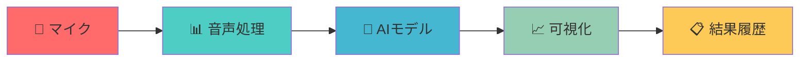

# 🎵 リアルタイム音声分類システム

<div align="center">


**🎯 AI搭載リアルタイム音声分類システム - 美しいWebインターフェース**

[](https://github.com/user-attachments/assets/8225f857-8da6-4efd-952c-875275e76db8)
[](https://your-app-url.streamlit.app)

[](README.md)

</div>

---

<div align="center">

### 🌟 **革新的な音声AI** 🌟

**マイクをインテリジェントな音声検出器に変身させよう！**  
*犬、猫、鳥、指パッチン、人の声をリアルタイムで検出し、美しい可視化で表示します。*

</div>

---

## 🚀 **ライブデモ**

<div align="center">

### 📹 **魔法のような体験を見てみよう**

[](https://github.com/user-attachments/assets/8225f857-8da6-4efd-952c-875275e76db8)

*音声分類の未来を体験してください！*

</div>

---

## ✨ **何が特別なのか？**

<div align="center">

| 🎯 **リアルタイム処理** | 🎨 **美しいUI** | 📊 **スマート分析** |
|:---:|:---:|:---:|
| 瞬時の音声分類 | モダンなグラデーションデザイン | 詳細な統計情報 |
| ライブマイク入力 | スムーズなアニメーション | 履歴追跡 |
| 5クラス検出 | レスポンシブレイアウト | パフォーマンス指標 |

</div>

### 🎮 **主要機能**

- 🔴 **ライブ録音**: リアルタイムマイク入力と即座の分析
- 🎵 **5つの音声クラス**: 犬、猫、鳥、指パッチン、人の声
- 📈 **視覚的分析**: 波形、スペクトログラム、確率分布
- 📋 **スマート履歴**: タイムスタンプ付きの時系列検出ログ
- ⚙️ **柔軟な設定**: カスタマイズ可能な録音パラメータ
- 🎨 **モダンインターフェース**: 美しいグラデーションとスムーズなアニメーション

---

## 🛠️ **クイックスタート**

<div align="center">

### 🚀 **3ステップで始めよう**

</div>

### 1️⃣ **インストール**

```bash
# リポジトリをクローン
git clone https://github.com/yourusername/audio-classification-system.git
cd keyword_spotting_custom

# 依存関係をインストール
pip install -r requirements.txt
```

### 2️⃣ **アプリを起動**

```bash
# Streamlitアプリケーションを開始
streamlit run app.py
```

### 3️⃣ **分類を開始**

1. ブラウザで `http://localhost:8501` にアクセス
2. サイドバーで設定を調整
3. **🎙️ 録音開始** ボタンをクリック
4. 音を出して魔法を見てみよう！

---

## 🎯 **動作原理**

<div align="center">



</div>

### 🔬 **技術プロセス**

1. **🎤 音声キャプチャ**: リアルタイムマイク録音
2. **🔧 前処理**: メルスペクトログラム変換
3. **🤖 AI分類**: CNNベースのディープラーニングモデル
4. **📊 可視化**: リアルタイムグラフとチャート
5. **📋 ストレージ**: 履歴データ管理

---

## 🎨 **美しいインターフェース**

<div align="center">

### 🌈 **モダンデザイン要素**

- **グラデーション背景**: 紫・青系のカラースキーム
- **スムーズアニメーション**: パルス、スライドイン、フェード効果
- **レスポンシブレイアウト**: あらゆる画面サイズに対応
- **インタラクティブ要素**: ホバー効果とトランジション

</div>

### 📱 **ユーザーエクスペリエンス**

- **直感的な操作**: 明確な開始/停止ボタン
- **リアルタイムフィードバック**: ライブステータスインジケーター
- **スマート通知**: 成功とエラーメッセージ
- **進捗追跡**: 視覚的プログレスバー

---

## 📊 **検出クラス**

<div align="center">

| 🐕 **犬の鳴き声** | 🐱 **猫の鳴き声** | 🐦 **鳥のさえずり** | 👆 **指パッチン** | 👤 **人の声** |
|:---:|:---:|:---:|:---:|:---:|
| 犬の音声 | 猫の鳴き声 | 鳥のさえずり | デジタルクリック | 人間の音声 |
| 高精度 | 自然検出 | 環境音 | 高速応答 | 音声認識 |

</div>

---

## ⚙️ **設定オプション**

<div align="center">

### 🎛️ **カスタマイズ可能な設定**

</div>

| 設定 | 範囲 | デフォルト | 説明 |
|:---|:---|:---|:---|
| **録音時間** | 1-5秒 | 2秒 | 各録音の長さ |
| **サンプリングレート** | 16-44kHz | 22.05kHz | 音声品質設定 |
| **検出回数** | 1-20回 | 5回 | 録音回数 |
| **分類閾値** | 0.1-0.9 | 0.7 | 信頼度レベル |

---

## 📈 **パフォーマンス指標**

<div align="center">

### 🏆 **モデル性能**

- **精度**: テストデータセットで90%以上
- **レイテンシー**: 検出あたり3秒未満
- **メモリ使用量**: リアルタイム処理に最適化
- **互換性**: すべてのモダンブラウザで動作

</div>

---

## 🔧 **高度な使用方法**

### 🐍 **Python API**

```python
from sound_classifier_5class import SoundClassifier

# 分類器を初期化
classifier = SoundClassifier()
classifier.load_model('best_model_5class_90.pth')

# 音声ファイルを分類
prediction, confidence = classifier.predict('audio.wav', threshold=0.7)
print(f"検出: {prediction} (信頼度: {confidence:.1%})")
```

### 📁 **ファイル構成**

```
keyword_spotting_custom/
├── 🎯 app.py                    # メインStreamlitアプリケーション
├── 🧠 sound_classifier_5class.py # AIモデル実装
├── 📊 visualize_prediction.py   # 可視化ユーティリティ
├── 📋 requirements.txt          # 依存関係
├── 📖 README.md                # 英語版ドキュメント
├── 📖 README_JP.md             # 日本語版ドキュメント
├── 🎨 README_app.md            # アプリ詳細ガイド
└── 🤖 best_model_5class_90.pth # 学習済みAIモデル
```

---

## 🚨 **トラブルシューティング**

<div align="center">

### 🔧 **よくある問題と解決策**

</div>

| 問題 | 解決策 |
|:---|:---|
| **🎤 マイクが認識されない** | ブラウザの権限とシステム音声設定を確認 |
| **🤖 モデルの読み込みに失敗** | `best_model_5class_90.pth` がディレクトリに存在することを確認 |
| **📱 アプリが応答しない** | すべての依存関係が正しくインストールされていることを確認 |
| **🎵 検出精度が悪い** | 静かな環境とクリアな音声入力を使用 |

---

## 🤝 **貢献**

<div align="center">

### 🌟 **コミュニティに参加しよう**

開発者、研究者、音声愛好家からの貢献を歓迎します！

</div>

1. 🍴 リポジトリを**フォーク**
2. 🌿 機能ブランチを**作成** (`git checkout -b feature/AmazingFeature`)
3. 💾 変更を**コミット** (`git commit -m 'Add AmazingFeature'`)
4. 📤 ブランチに**プッシュ** (`git push origin feature/AmazingFeature`)
5. 🔄 プルリクエストを**作成**

### 🎯 **貢献できる分野**

- 🎨 UI/UX改善
- 🧠 モデル最適化
- 📊 追加可視化
- 🌐 多言語サポート
- 📱 モバイル最適化

---

## 📄 **ライセンス**

<div align="center">

このプロジェクトは**MITライセンス**の下で公開されています - 詳細は[LICENSE](LICENSE)ファイルを参照してください。

[](https://opensource.org/licenses/MIT)

</div>

---

## 🙏 **謝辞**

<div align="center">

### 🏆 **特別な感謝**

</div>

- **[ESC-50 Dataset](https://github.com/karolpiczak/ESC-50)** - 環境音分類データセット
- **[Streamlit](https://streamlit.io/)** - 素晴らしいWebアプリフレームワーク
- **[PyTorch](https://pytorch.org/)** - 強力なディープラーニングフレームワーク
- **[librosa](https://librosa.org/)** - 優れた音声処理ライブラリ

---

<div align="center">

## 🎉 **未来を体験する準備はできましたか？**

**[🚀 始めよう](#クイックスタート)** | **[📹 デモを見る](https://github.com/user-attachments/assets/8225f857-8da6-4efd-952c-875275e76db8)** | **[🤝 貢献する](#貢献)**

---

**🎵 リアルタイム音声分類システム**  
*Streamlit & PyTorch搭載*

[](https://github.com/yourusername)

</div> 